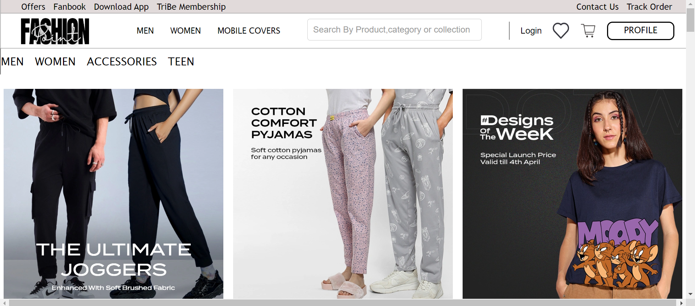
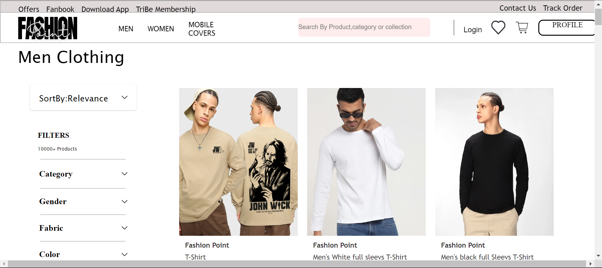
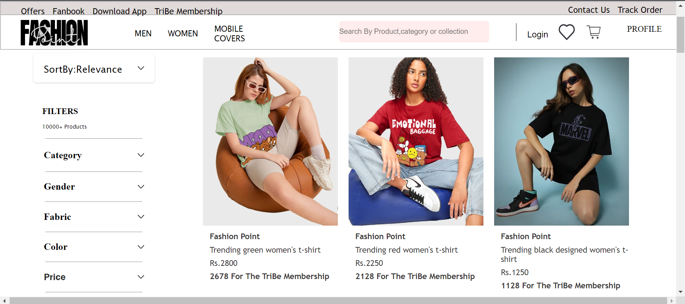
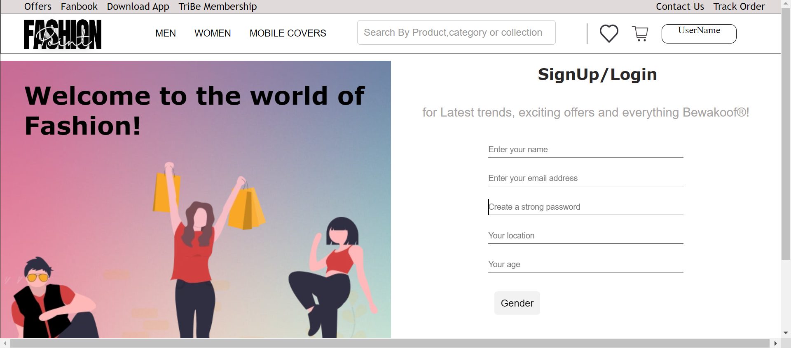
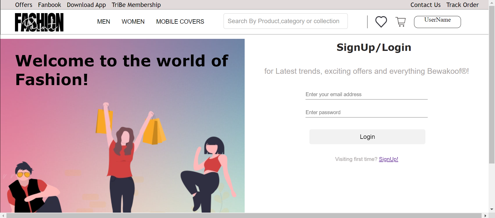
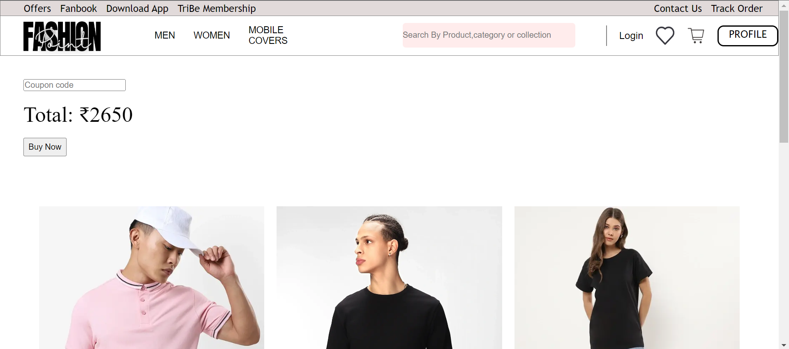
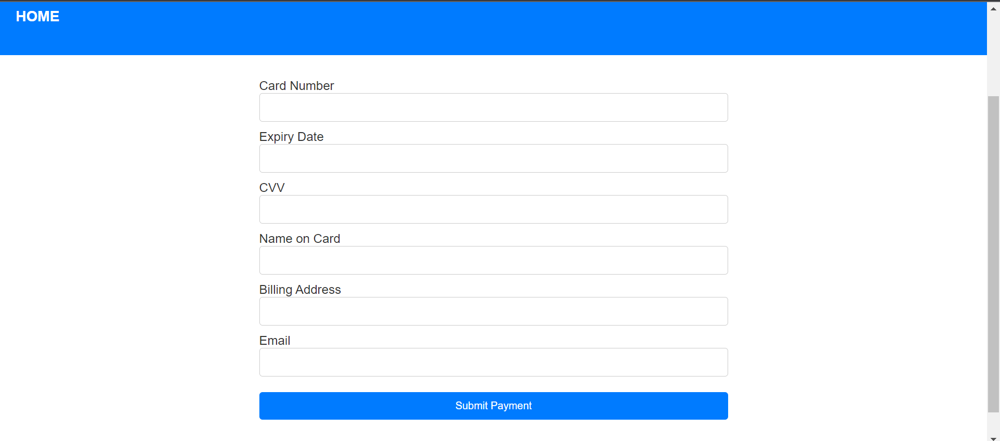

<h1> fashion Point <h1>
  
<h3>Fashion Point is a clone of a website called bewakoof.com, an Indian e-commerce website offering affordable and trendy clothing for men and women, known for its quirky designs and engaging social media presence. Its humorous approach to fashion and wide range of products has gained popularity.</h3>

- An Individual project built in 5 days
- Deployed link - bewakoof-com-wine.vercel.app/

 # Features

You can create your account using the login and signup option with Firebase, using API calls for validating user credentials.

You can choose a product you want to buy and add it to the cart section.
  
Users can log out from the website.
  
The user can't access the cart page and wishlist page without login in.
  
Users can also select and remove items from the cart section and make payments through a card.

All the data is stored in the MongoDB Database for users and items.
  
  
<h2>Landing Page</h2>

  
  <h2>Men's Page</h2>

  
  <h2>Women's Page</h2>

  
  <h2>Signup page</h2>

  <h2>Login Page</h2>

  
  <h2>Cart Page</h2>

  
  <h2>Payment Page</h2>

  
  
  ## Feedback

If you have any feedback, please reach out to us at ma8183468@gmail.com 
  
  
>>>>>>> a1618fae6dcf30d199ed3fba73e3dd8f7947ff00
